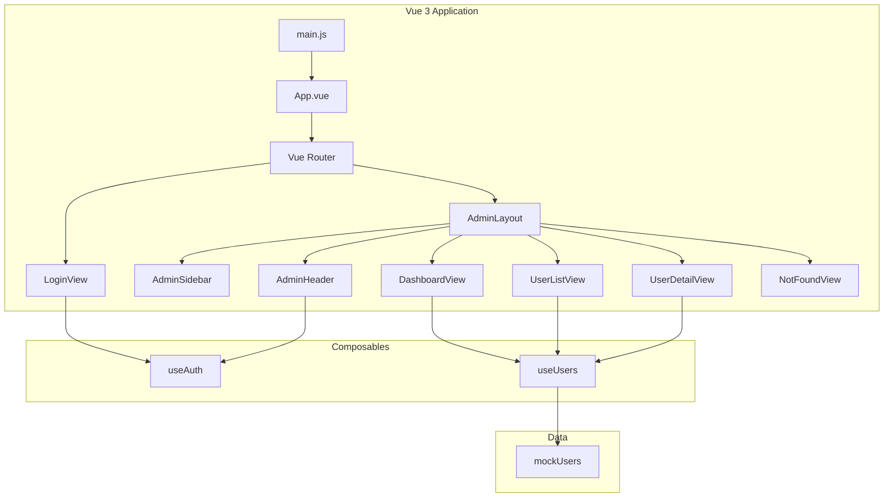

# Admin Dashboard

> A Vue 3 + Vite admin panel with authentication, user management, and responsive layout built with Tailwind CSS and DaisyUI.

## Table of Contents

- [Features](#features)
- [Quick Start](#quick-start)
- [Installation](#installation)
- [Usage](#usage)
- [Configuration](#configuration)
- [Architecture](#architecture)
- [API Reference](#api-reference)
- [Development](#development)
- [Testing](#testing)
- [Deployment](#deployment)
- [Contributing](#contributing)
- [License](#license)

## Features

- **Authentication** — Login/logout with session persistence via localStorage and route guards
- **Dashboard Overview** — KPI stat cards, top users panel, and recent activity feed
- **User Management** — Searchable user list with real-time filtering by name or email
- **User Detail View** — Tabbed profile page with overview, activity log, and session management
- **Responsive Layout** — Collapsible sidebar with desktop icon-only mode and mobile overlay drawer
- **Lazy-Loaded Routes** — Code-split per page for optimal initial bundle size
- **Tailwind CSS + DaisyUI** — Utility-first styling with a consistent design-token system

## Quick Start

### Prerequisites

| Dependency | Version | Purpose |
|-----------|---------|---------|
| Node.js | ^22.18.0 or >=24.12.0 | Runtime |
| pnpm | latest | Package manager |

```bash
pnpm install
pnpm dev
```

Open `http://localhost:5173` and log in with `admin` / `password`.

## Installation

### From source

```bash
git clone <repo-url>
cd admin-dashboard
pnpm install
```

## Usage

### Development server

```bash
pnpm dev
```

### Production build

```bash
pnpm build
pnpm preview
```

## Configuration

| Variable | Type | Default | Description |
|----------|------|---------|-------------|
| `BASE_URL` | `string` | `/` | Vite base public path (set in `vite.config.js`) |

Configuration files:

| File | Purpose |
|------|---------|
| `vite.config.js` | Vite build configuration, plugins, and path aliases |
| `eslint.config.js` | ESLint flat config with Vue and Prettier integration |
| `.oxlintrc.json` | OxLint fast-lint rules |
| `.prettierrc.json` | Prettier formatting rules |
| `jsconfig.json` | IDE path alias resolution (`@` → `src/`) |

## Architecture



The application follows a composable-based architecture where shared state (authentication, user data) is managed through Vue 3 composition API composables with module-level singleton refs.

See [docs/architecture.md](docs/architecture.md) for full details.

## API Reference

| Module | Description |
|--------|-------------|
| `composables/useAuth` | Authentication state, login/logout actions, session persistence |
| `composables/useUsers` | User list access, per-user fetch with loading/error state |
| `data/mockUsers` | Static mock user dataset (5 users with full profile data) |
| `router/index` | Route definitions, navigation guards, post-navigation hooks |

See [docs/api-reference.md](docs/api-reference.md) for full API documentation.

## Development

### Setup

```bash
pnpm install
```

### Available scripts

| Command | Description |
|---------|-------------|
| `pnpm dev` | Start Vite dev server with HMR |
| `pnpm build` | Production build to `dist/` |
| `pnpm preview` | Preview production build locally |
| `pnpm lint` | Run all linters (OxLint + ESLint) with auto-fix |
| `pnpm format` | Format source files with Prettier |

### Project structure

```
admin-dashboard/
├── src/
│   ├── main.js              # App entry point
│   ├── App.vue              # Root component (RouterView wrapper)
│   ├── assets/              # Global CSS and static assets
│   ├── components/
│   │   ├── layout/          # AdminLayout, AdminSidebar, AdminHeader
│   │   └── ui/              # Reusable UI primitives (UserCard)
│   ├── composables/         # Shared composition API logic (useAuth, useUsers)
│   ├── data/                # Static mock data (mockUsers)
│   ├── router/              # Vue Router configuration and guards
│   └── views/               # Page-level route components
├── public/                  # Static assets served as-is
├── docs/                    # Project documentation
├── dist/                    # Production build output
├── vite.config.js           # Vite configuration
├── eslint.config.js         # ESLint flat config
├── jsconfig.json            # IDE path alias config
└── package.json             # Dependencies and scripts
```

## Testing

No test framework is currently configured. To add one:

```bash
# Example: Vitest
pnpm add -D vitest @vue/test-utils
```

## Deployment

### Environment variables

| Variable | Required | Description |
|----------|----------|-------------|
| `BASE_URL` | No | Public base path for the app (defaults to `/`) |

### Deploy steps

1. Run `pnpm build` to generate the production bundle in `dist/`
2. Deploy the `dist/` directory to any static hosting provider (Netlify, Vercel, Cloudflare Pages, etc.)
3. Configure SPA fallback: all routes should serve `index.html`

## Contributing

1. Fork the repository
2. Create a feature branch (`git checkout -b feature/name`)
3. Make changes and ensure code passes linting
4. Run `pnpm lint` and `pnpm format`
5. Commit with conventional commit messages
6. Push and open a Pull Request

### Code style

- **ESLint** — Vue 3 recommended rules with Prettier integration
- **OxLint** — Fast supplementary linting
- **Prettier** — Consistent formatting (see `.prettierrc.json`)

## License

Private — not licensed for external distribution.
