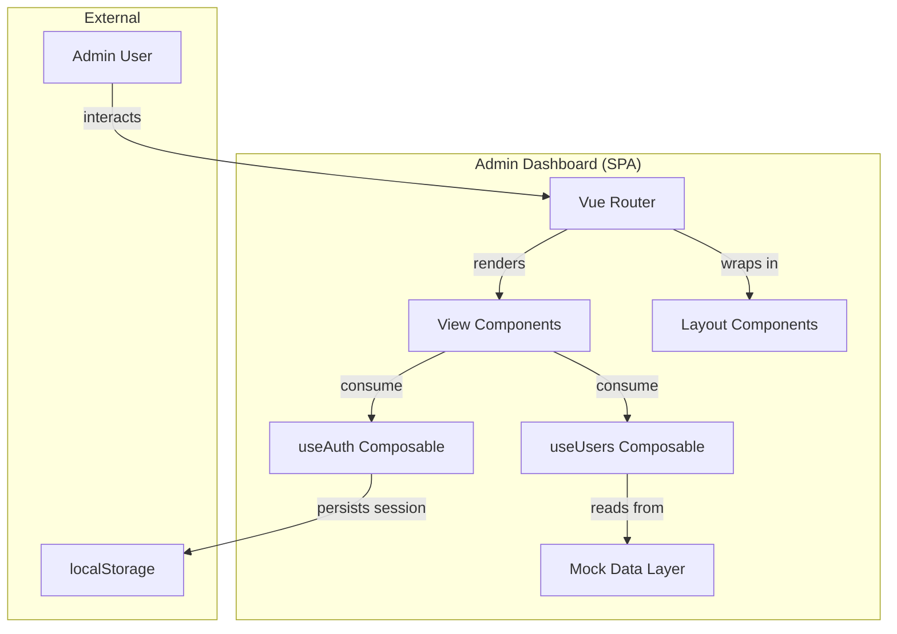
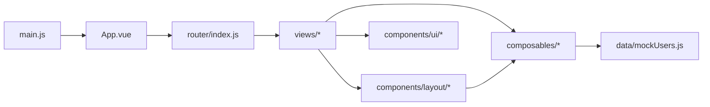
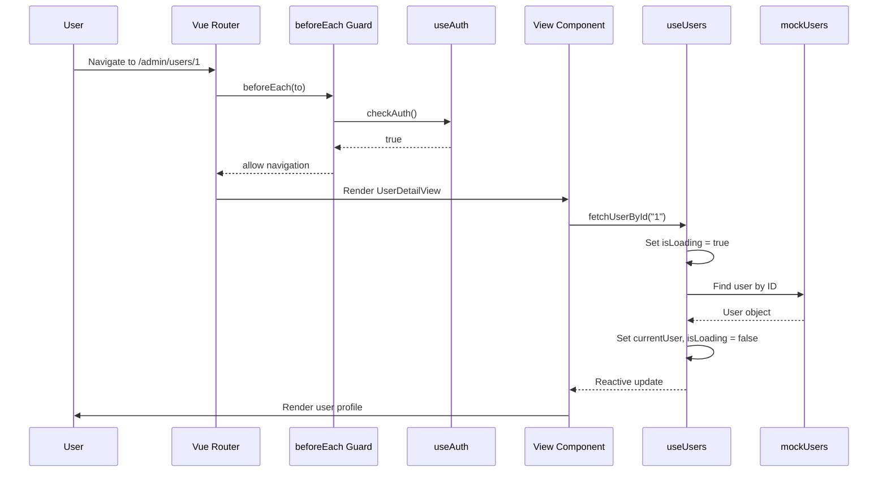
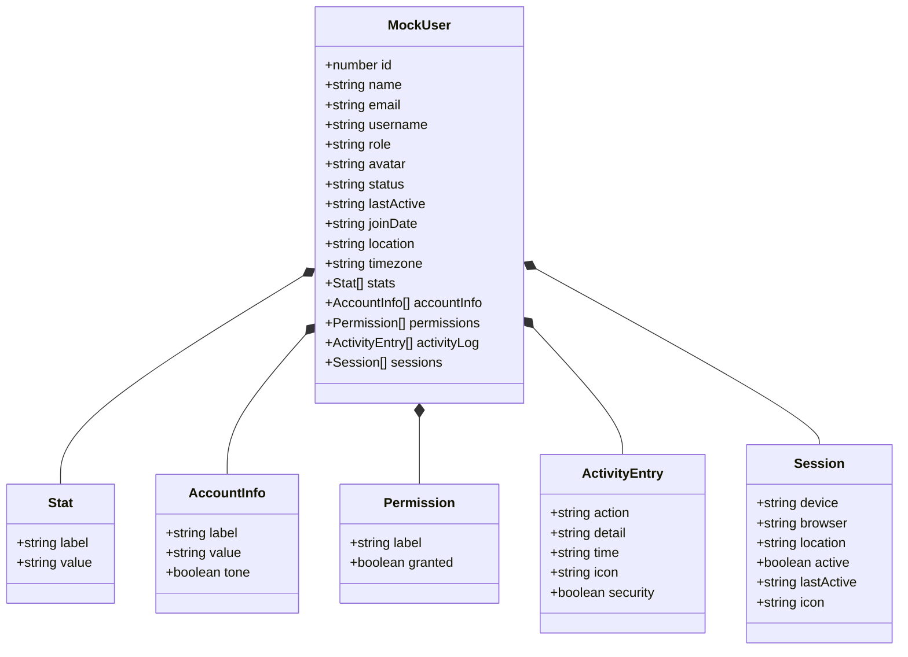
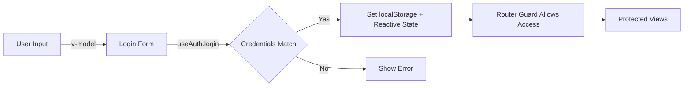

# Architecture Overview

> System design and structure for Admin Dashboard. Last updated: 2026-08-30.

## Table of Contents

- [System Context](#system-context)
- [Module Structure](#module-structure)
- [Data Flow](#data-flow)
- [Entity Hierarchy](#entity-hierarchy)
- [Technology Stack](#technology-stack)
- [Directory Structure](#directory-structure)
- [Design Decisions](#design-decisions)
- [Security Architecture](#security-architecture)
- [Performance Considerations](#performance-considerations)

---

## System Context



The application is a client-side single-page application (SPA) with no backend server. Authentication state is persisted in `localStorage`, and all data is served from an in-memory mock dataset. This architecture is designed for frontend demonstration and can be extended with a real API layer by replacing the `mockUsers` data source.

---

## Module Structure



| Module | Responsibility | Dependencies |
|--------|---------------|--------------|
| `main.js` | App bootstrap, plugin registration, DOM mount | `App.vue`, `router` |
| `router/` | Route definitions, navigation guards, page title sync | `composables/useAuth` |
| `composables/useAuth` | Authentication state, login/logout, session persistence | `vue` (reactivity) |
| `composables/useUsers` | User list access, per-user fetch with loading/error | `vue`, `data/mockUsers` |
| `data/mockUsers` | Static user dataset (5 profiles with nested data) | none |
| `components/layout/` | AdminLayout, AdminSidebar, AdminHeader | `vue-router`, `composables/useAuth` |
| `components/ui/` | UserCard reusable component | none |
| `views/` | Page-level route components | `composables/*`, `components/*` |

### Module details

#### `composables/useAuth`

- **Purpose:** Singleton authentication module with reactive state and localStorage persistence
- **Public API:** `useAuth()` → `{ isAuthenticated, currentUsername, loginTime, login, logout, checkAuth }`
- **Dependencies:** Vue reactivity (`ref`, `readonly`)

#### `composables/useUsers`

- **Purpose:** Shared user data access with simulated async fetch
- **Public API:** `useUsers()` → `{ users, currentUser, isLoading, errorMessage, fetchUserById }`
- **Dependencies:** Vue reactivity, `data/mockUsers`

#### `router/index`

- **Purpose:** Route configuration with lazy-loaded components, auth guards, and post-navigation hooks
- **Public API:** Default export (Router instance)
- **Dependencies:** `vue-router`, `composables/useAuth`

---

## Data Flow



### Critical flows

1. **Authentication flow:** User submits credentials → `useAuth.login()` validates → state + localStorage updated → router guard allows access → redirect to original destination
2. **Protected navigation:** Router guard checks `checkAuth()` → if unauthenticated, redirect to `/login` with `redirect` query param → after login, restore original path
3. **User detail fetch:** Route resolves with `:id` param → `UserDetailView` calls `fetchUserById()` → loading skeleton shown → data arrives → tabbed profile rendered

---

## Entity Hierarchy



| Entity | Source | Key Relationships |
|--------|--------|-------------------|
| `MockUser` | `data/mockUsers.js` | Contains nested `Stat[]`, `AccountInfo[]`, `Permission[]`, `ActivityEntry[]`, `Session[]` |

---

## Technology Stack

| Layer | Technology | Version | Purpose |
|-------|-----------|---------|---------|
| Language | JavaScript (ES Modules) | ES2024+ | Application logic |
| Framework | Vue 3 (Composition API) | ^3.5.40 | Reactive UI framework |
| Router | Vue Router 4 | ^4.6.4 | Client-side routing with guards |
| Build Tool | Vite | ^8.1.5 | Dev server + production bundler |
| CSS | Tailwind CSS 4 | ^4.3.3 | Utility-first styling |
| Component Library | DaisyUI 5 | ^5.7.22 | Pre-built UI components (dropdowns, etc.) |
| Linting | ESLint + OxLint | ^10.7.0 / ~1.74.0 | Code quality enforcement |
| Formatting | Prettier | 3.9.5 | Consistent code style |
| Package Manager | pnpm | latest | Fast, disk-efficient dependency management |

---

## Directory Structure

```
admin-dashboard/
├── src/
│   ├── main.js              # Entry point — bootstraps app, installs router
│   ├── App.vue              # Root component — thin RouterView wrapper
│   ├── assets/              # Global CSS (Tailwind imports)
│   ├── components/
│   │   ├── layout/          # AdminLayout, AdminSidebar, AdminHeader
│   │   └── ui/              # UserCard (reusable user row component)
│   ├── composables/         # useAuth, useUsers (shared state logic)
│   ├── data/                # mockUsers (static dataset)
│   ├── router/              # Route config, guards, afterEach hooks
│   └── views/               # Dashboard, Login, UserList, UserDetail, NotFound
├── public/                  # Static assets (favicon, etc.)
├── docs/                    # Documentation (architecture, API reference)
├── dist/                    # Production build output
├── vite.config.js           # Vite config (plugins, aliases)
├── eslint.config.js         # ESLint flat config
├── .oxlintrc.json           # OxLint config
├── .prettierrc.json         # Prettier config
├── jsconfig.json            # Path alias config for IDE
└── package.json             # Dependencies and scripts
```

| Directory | Purpose |
|-----------|---------|
| `src/composables/` | Shared Composition API logic (singleton state) |
| `src/components/layout/` | Structural layout components (sidebar, header, shell) |
| `src/components/ui/` | Reusable UI primitives |
| `src/views/` | Page-level route components |
| `src/data/` | Static/mock data modules |
| `src/router/` | Vue Router configuration |
| `docs/` | Project documentation |

---

## Design Decisions

### Decision 1: Module-level singleton refs for shared state

- **Context:** Multiple components need access to the same auth state and user data
- **Options considered:**
  1. Pinia/Vuex store — full-featured but heavyweight for this app's scope
  2. Provide/Inject — requires component tree proximity, harder to test
  3. Module-level refs in composables — lightweight, auto-shared via import
- **Decision:** Module-level `ref()` in composable files, exposed as `readonly`
- **Rationale:** Zero boilerplate, no extra dependencies, reactive by default, and the `readonly` wrapper prevents accidental mutation from consumers
- **Consequences:** No devtools integration (unlike Pinia), but sufficient for the current scope

### Decision 2: Lazy-loaded route components

- **Context:** Initial bundle size affects time-to-interactive
- **Decision:** Every route component uses `() => import(...)` dynamic import
- **Rationale:** Each page is code-split into its own chunk, loaded only when navigated to
- **Consequences:** Slight delay on first visit to each route (mitigated by simulated loading states)

### Decision 3: Simulated async with `setTimeout`

- **Context:** No real backend; need to demonstrate loading/error states
- **Decision:** `setTimeout` wrappers in `login()` and `fetchUserById()`
- **Rationale:** Allows the UI to exercise loading skeletons, error handling, and transitions without a server
- **Consequences:** Not suitable for production; must be replaced with real API calls

---

## Security Architecture



| Concern | Implementation | Notes |
|---------|---------------|-------|
| Authentication | Hardcoded credentials (`admin`/`password`) | Demo only — replace with real auth provider |
| Session persistence | `localStorage` keys: `isLoggedIn`, `username`, `loginTime` | Survives page reloads |
| Route protection | `beforeEach` guard checks `meta.requiresAuth` | Redirects to `/login` with `redirect` query param |
| State immutability | `readonly()` wrapper on exposed refs | Prevents consumers from mutating auth state directly |
| Input validation | Client-side trim + non-empty check | No server-side validation (no backend) |

---

## Performance Considerations

| Bottleneck | Mitigation | Target |
|-----------|-----------|--------|
| Initial bundle size | Route-level code splitting via lazy imports | < 100 KB initial JS |
| Re-render cost | `computed()` for derived data (filtered users, top users) | Only recompute when dependencies change |
| CSS payload | Tailwind CSS purges unused utilities at build time | Minimal CSS output |
| Navigation UX | Skeleton loaders during async data fetch | Perceived latency < 600 ms |
